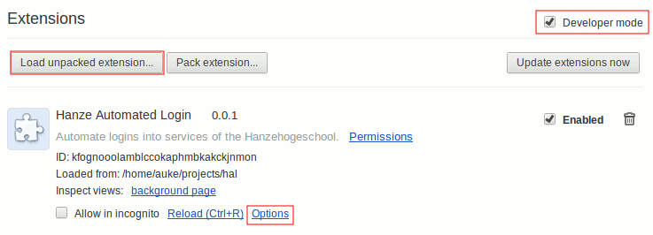

Hanze AutoLogin
===============
Because it is annoying to fill in my password every time use a service of
the Hanzehogeschool and I couldn't sleep I came up with this Chrome extension. 
It logs you in automatically when you use a service on \*.hanze.nl websites.

Installation and configuration
------------------------------
Visit `chrome://extensions` in your Chrome browser and enable **Developer 
mode** in de upper right corner. Click **Load unpack extension...** and select
the folder with this exension. Now click on options and set your username and 
password on the options page of the exentension.

Now visit a website like [digirooster.hanze.nl][1] and see the magic happen.

Security considerations
-----------------------
Currently no encryption has been used to encrypt your credentials. The
exension runs in an [isolated world][2] and therefore no other Javascript
or Chrome extensions could access these variables. But when an attacker somehow
takes over your screen he'll be able to make the credentials visible. This
also true for the default password manager in Chrome, visit 
`chrome://settings/passwords`. Saving passwords in a browser is never good
practise. 

[1]: https://digirooster.hanze.nl
[2]: http://developer.chrome.com/extensions/content_scripts.html#execution-environment]
